# Create your own Cryptocurrency Token using Blockmason Link
## Goal
In this activity, we will create our own cryptocurrency smart contract and deploy it to the public Ethereum Ropsten network. We will then be able to use/trade this new token!

## Exercise
This activity will require you to:
* Use Link (https://mason.link) to deploy your token smart contract on the Ropsten network
* Use MetaMask and designate a wallet address as the treasury for your cryptocurrency, holding the entire supply
* Use https://ropsten.etherscan.io/ to see the details of the transaction
* Use your Infura URL to connect to the Ropsten network

## General activity notes
* This activity uses the Link *New Project* wizard to create and deploy the new contract. 
* The `Default Account` in Link must be sent some test ETH in order for Link to deploy the contract
* If Link logs you out, just start the *New Project* wizard again - the different objects created during the process will be saved.

### Setup
> Use your MetaMask wallet, on the Ropsten network, to send a small amount of ETH (e.g 0.25) to the Link default account address:
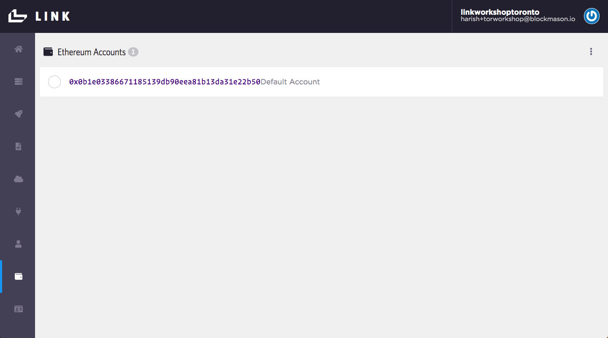

### Create your Custom Token Contract
> Open up the file `ANYToken.sol`

This is the smart contract which will be used to create and deploy your custom token. Changes you need to make are:
```
// Name your custom token
    string public constant name = "ANY TOKEN";
```
> Change `ANY` to the name of your token

```
//Token symbol
    string public constant symbol = "ANY";
```
> Change `ANY` to the currency symbol you want to use for your token. 

> Now go back and update the name of your contract using the symbol you've selectee:
```
contract ANYToken {
...
}
```
Now in the contract `constructor`, you will select an Ethereum address to use for the treasury and set the currency supply. 

> Select a MetaMask wallet address that you'd like to use (e.g. Account 1) and add that to:
```
// Add your MetaMask wallet address here
    treasury = <your address here>;
```

> Then set the currency supply. In the following example, the total supply is set to 1000 ANY tokens.
```
//Select your total supply token
    totalSupply = 1000 * 10**uint(decimals);
```
That's it! Your custom token contract is now ready to be deployed on the Ropsten network using Link.

### Deploy your Custom Token contract to Ropsten
Unlike in the past activity where we could simply copy and paste the smart contract code into the Link IDE to deploy to the Link *private network*, we will need to use the Link project wizard to deploy our smart contract to the public Ethereum Ropsten network.

> Start the Link project wizard by selecting `New Project` in the profile dropdown menu:
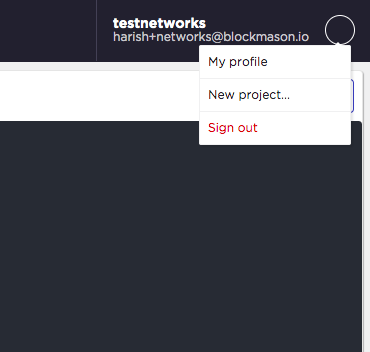

> We will create a new contract to use:
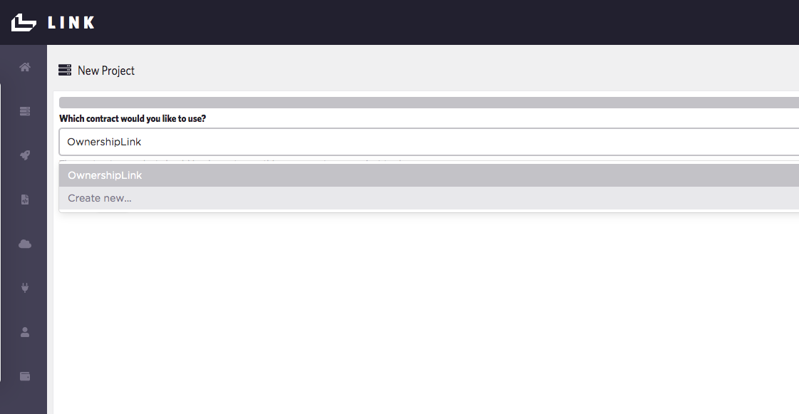

> Copy and paste your Solidity code from `ANYToken.sol` into the source code area. Name your contract for Link.
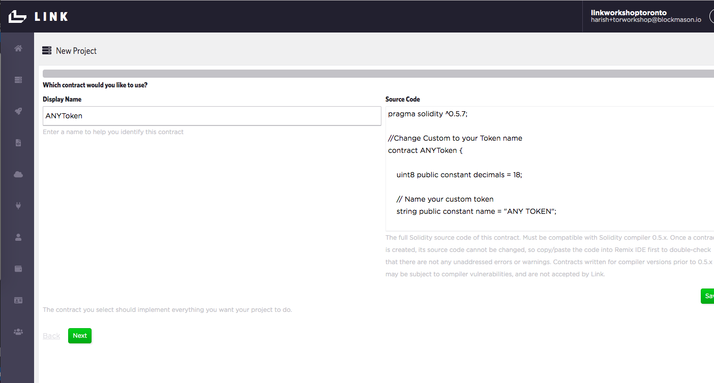

> Next, use the `Default Account` as your Ethereum Account.

> Then we're going to create a new Network and call it `Ropsten`. Leave the default `Block Confirmations Needed` as 0. 

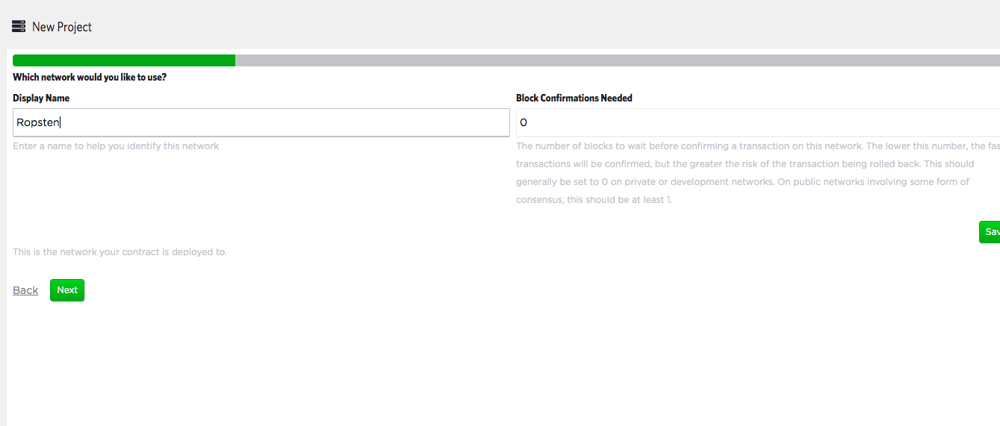.

> Then we need to connect to the Ropsten Network and will do so using Infura's API. As you did in the first activity, copy the Ropsten API URL from Infura into Link:
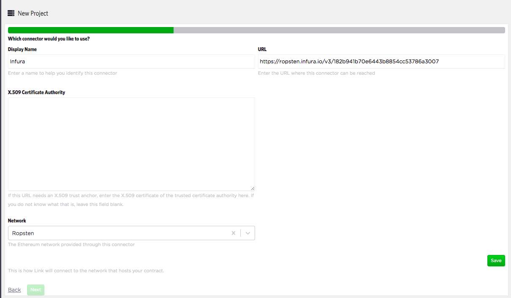

> Now we're ready to deploy the contract. Enter in a `Display Name` (e.g. ANYTokenDeployment), leave the `Address` field blank since the contract hasn't already been deployed, select the `Contract` and `Network` as below:
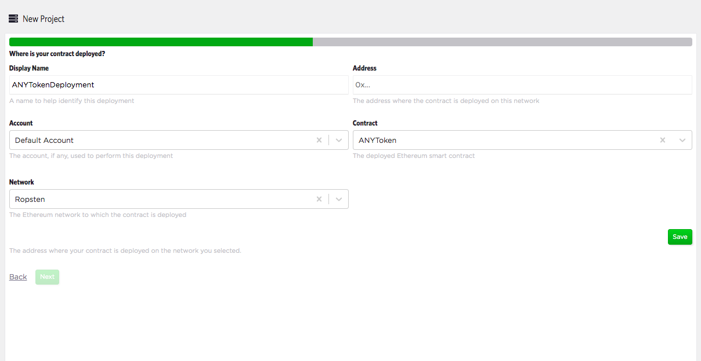

> Then deploy your contract! This could take up to a minute to deploy on the Ropsten network.
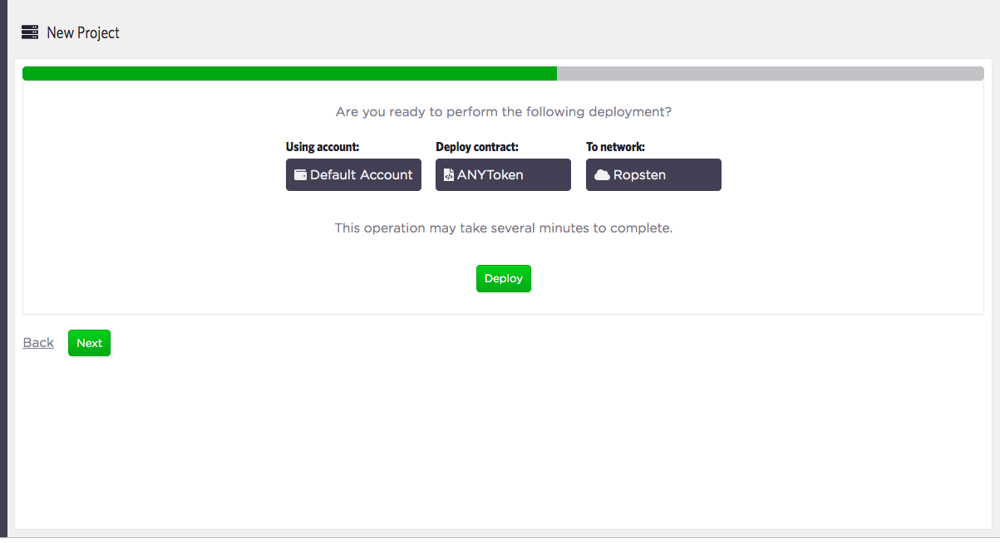

> Now that your contract is deployed, we will name the API:
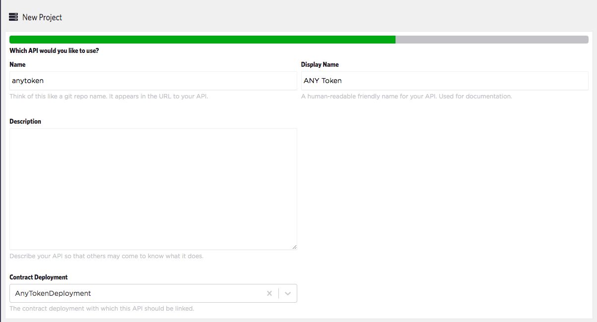

> Lastly, we will setup the API consumer that will be authenticated to use the API created above.
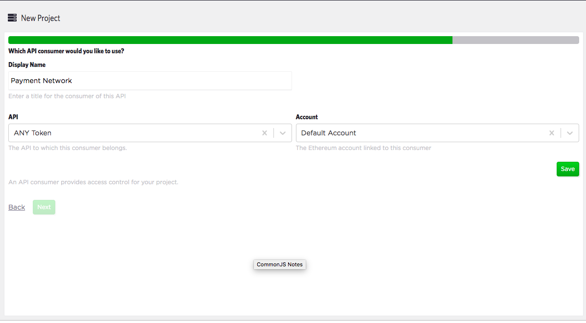

> Use the default OAuth2.0 client.

When finished with the wizard, you should end up with a screen summarizing your API endpoints along with funding and auth details:
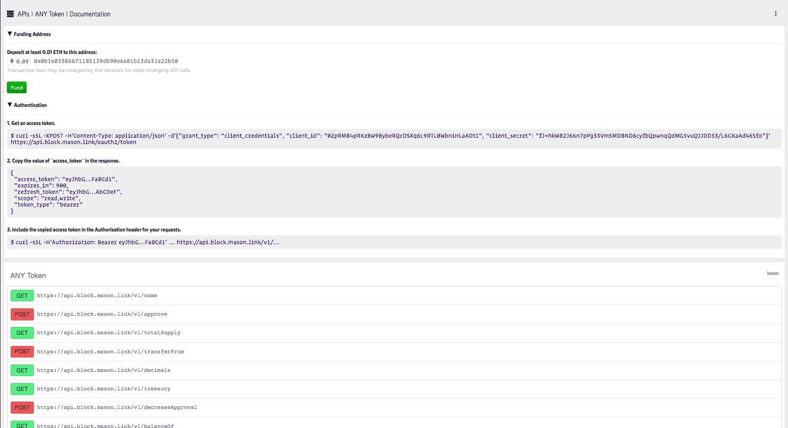

Now the cool part - let's see the details of our token contract deployed on Ropsten using the Etherscan explorer. First we need to find the address the custom token contract is deployed to:

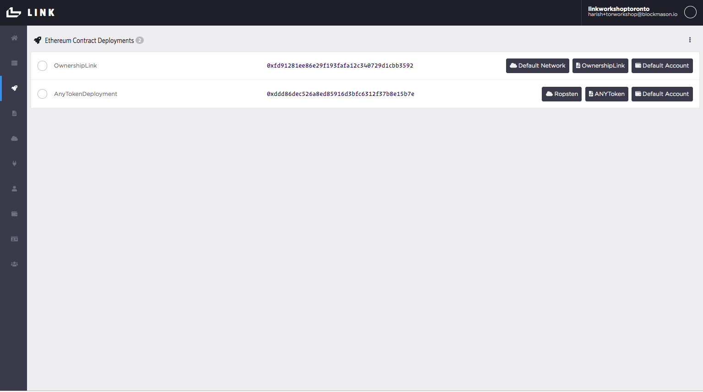

> The contract address here is `0xddd86dec526a8ed85916d3bfc6312f37b8e15b7e`. Search this address on Etherscan at: https://ropsten.etherscan.io.


> Click on the `Token Tracker: ANY Token (ANY)` link to get the token details:

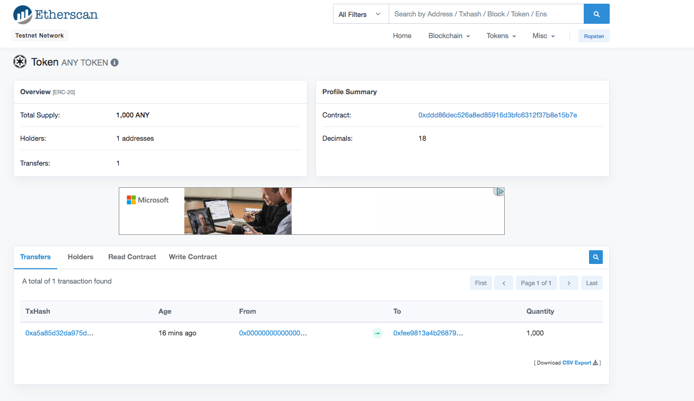

And finally to confirm, open up MetaMask under the same account that is the treasury of your newly minted custom token, and add your token using the contract address as follows:
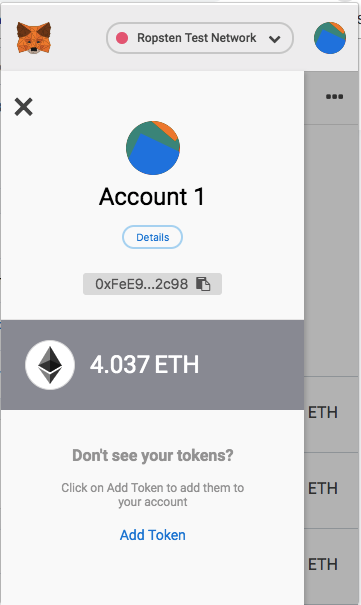

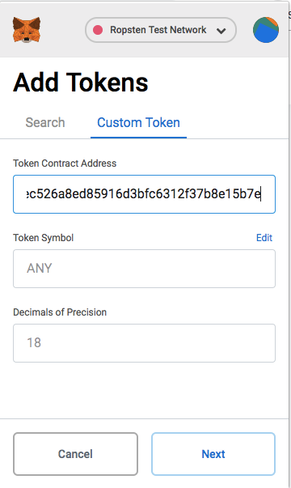

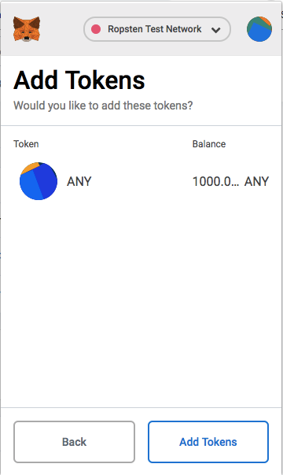

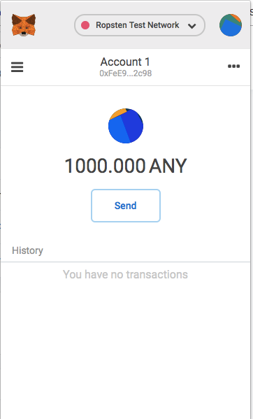

**Congratulations!! You have successfully created and deployed your very own custom ERC-20 token to the public Ethereum Ropsten network** You can now send these tokens to your friends as souvenirs :)

In the second part of the next activity, we will use this custom token as part of the payment network for our **Collectible Stamps App**.